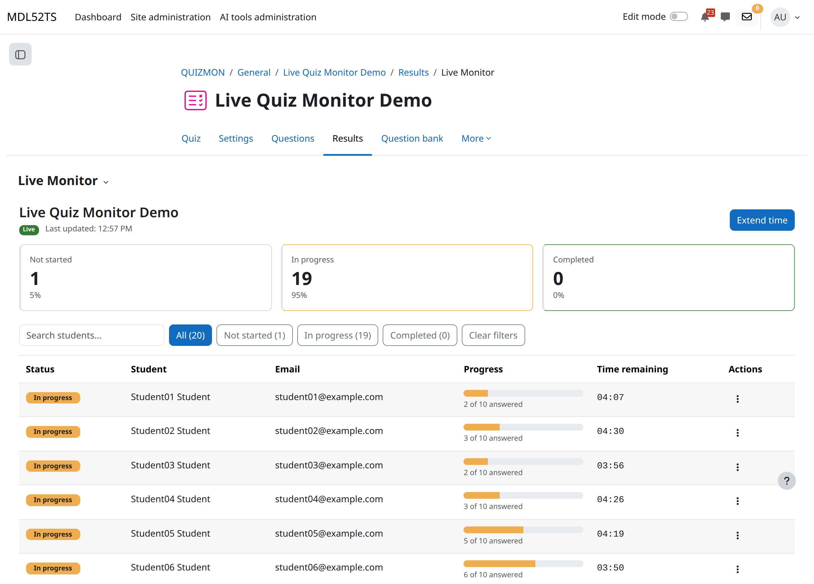

# Live quiz monitor

A Moodle quiz report subplugin that gives teachers a real-time view of a quiz
attempt in progress — who is attempting, their live progress, and per-student
supervision notes.

- **Component:** `quiz_livequizmonitor`
- **Type:** Quiz report (`mod/quiz/report/`)
- **Maturity:** Alpha
- **Release:** v0.1.4
- **License:** GNU GPL v3 or later

## Screenshot



## Features

- **Live monitoring** — auto-refreshing table of quiz attempts showing each
  student's live progress (questions answered).
- **Supervision notes** — write and edit per-student notes from the report,
  stored against the student and quiz.
- **Group support** — respects the activity's group mode; filter the monitor
  by group.
- **Row action menu** — per-row actions (e.g. extend time) via a dropdown menu.
- **Privacy** — implements the Moodle Privacy API for the supervision notes it
  stores.

## Requirements

- Moodle **4.5** or later (`requires = 2024100700`).
- Works on both **Bootstrap 4** (Moodle 4.5) and **Bootstrap 5** (Moodle 5.x).
  The UI emits both `data-toggle` and `data-bs-toggle` so dropdowns open on
  either version.

## Installation

1. Copy the plugin into your Moodle install:

   ```
   mod/quiz/report/livequizmonitor
   ```

2. Log in as an administrator and visit **Site administration → Notifications**
   to complete the database upgrade.

Or install with Git:

```bash
cd /path/to/moodle/mod/quiz/report
git clone https://github.com/marcusgreen/moodle-quiz_livequizmonitor.git livequizmonitor
```

> The plugin directory **must** be named `livequizmonitor`.

## Usage

1. Open a quiz activity.
2. Go to the quiz **Results** tabs.
3. Select **Live Monitor**.

The report shows attempts for the current activity (and selected group), and
refreshes as students progress.

## Capabilities

| Capability | Purpose | Default roles |
|------------|---------|---------------|
| `quiz/livequizmonitor:view` | View the live quiz monitor report | teacher, editingteacher, manager |

`quiz/livequizmonitor:view` carries the `RISK_PERSONAL` flag — it exposes
personal information about students.

## Development

JavaScript is written as AMD modules in `amd/src/`. After editing, rebuild the
bundle from the Moodle root:

```bash
npx grunt amd --root=mod/quiz/report/livequizmonitor
```

Run the tests:

```bash
# PHPUnit
vendor/bin/phpunit --testsuite quiz_livequizmonitor_testsuite

# Behat
php admin/tool/behat/cli/run.php --tags=@quiz_livequizmonitor
```

The `cli/` directory contains helper scripts for seeding demo and test data in
a development environment.

## Privacy

The plugin stores supervision notes linked to students and quizzes. See the
Privacy API metadata in `classes/privacy/` for the exact data stored and the
export/delete behaviour.
