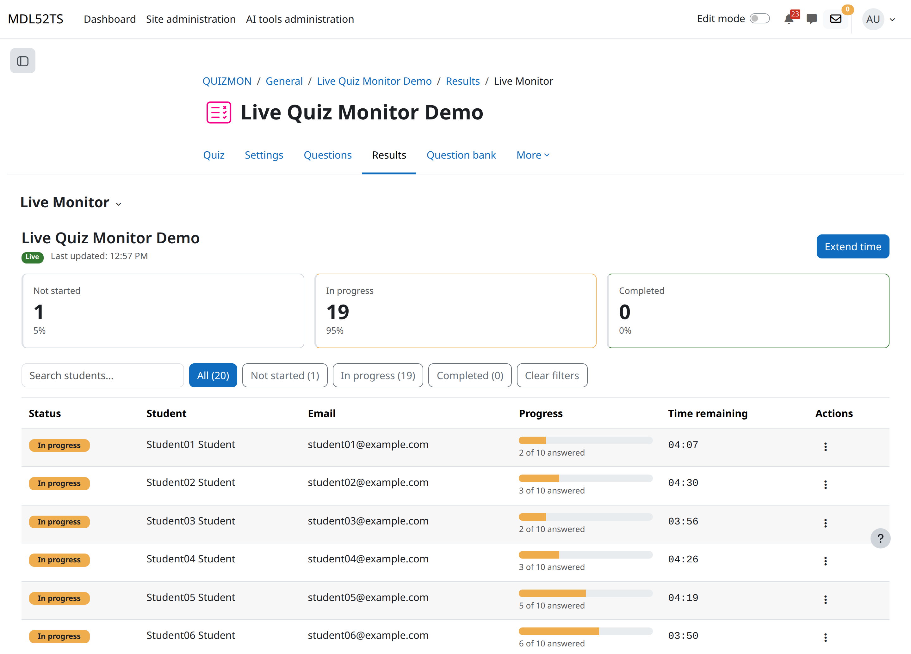

moodle-quiz_livequizmonitor
===========================

Moodle quiz report subplugin that gives teachers a real-time view of quiz attempts in progress — who is attempting, live progress, time remaining, and per-student supervision tools (notes, extend time, and related actions).

Requirements
------------

This plugin requires Moodle 4.5+

Motivation for this plugin
--------------------------

During supervised or high-stakes quizzes, teachers need a fast overview of who has started, who is still working, who may need help, and how much time is left — without opening every attempt individually. Moodle's built-in quiz reports are strong for after-the-fact analysis, but less suited to live invigilation.

This plugin adds a Live Monitor report that refreshes while the quiz runs, so supervisors can follow progress, filter the cohort, leave short notes, and take support actions (such as extending time) from one place.

Installation
------------

Install the plugin like any other plugin to folder
/mod/quiz/report/livequizmonitor

See http://docs.moodle.org/en/Installing_plugins for details on installing Moodle plugins

Usage & Settings
----------------

After installing the plugin, it is ready to use without the need for any configuration.

1. Open a quiz activity.
2. Go to the quiz **Results** tabs.
3. Select **Live Monitor**.

The report shows the current activity (and selected group, if group mode is used) and refreshes as students progress.

If you want to learn more about using quiz report plugins in Moodle, please see https://docs.moodle.org/en/Quiz_reports.

Capabilities
------------

This plugin also introduces these additional capabilities:

### quiz/livequizmonitor:view

Allows viewing the Live Monitor report for a quiz. It is assigned to the teacher, editing teacher, and manager roles by default (cloned from `mod/quiz:viewreports`). The capability carries the `RISK_PERSONAL` flag because the report exposes personal information about students.

Scheduled Tasks
---------------

This plugin does not add any additional scheduled tasks.

How this plugin works
---------------------

The Live Monitor is a quiz report page backed by AJAX/web services. On load and on a short poll interval it fetches a monitor state for the quiz (and optional group): status summary tiles, a filterable student table, progress, and time remaining.

Typical statuses include not started, in progress, idle (no recent attempt activity), and completed. From each student row, authorised users can open actions such as writing a supervision note or extending quiz time. Optional integrations (for example One Session unblock, or showing the quiz password) appear when the related plugins/settings are available.

Theme support
-------------

This plugin is developed and tested on Moodle Core's Boost theme.
It should also work with Boost child themes, including Moodle Core's Classic theme. However, we can't support any other theme than Boost.

Plugin repositories
-------------------

This plugin is published and regularly updated in the Moodle plugins repository:
https://marketplace.moodle.com/plugins/quiz_livequizmonitor

The latest development version can be found on Github:
https://github.com/ssystems-de/moodle-quiz_livequizmonitor

Bug and problem reports
-----------------------

This plugin is carefully developed and thoroughly tested, but bugs and problems can always appear.

Please report bugs and problems on Github:
https://github.com/ssystems-de/moodle-quiz_livequizmonitor/issues

Community feature proposals
---------------------------

The functionality of this plugin is primarily implemented for the needs of our clients and published as-is to the community. We are aware that members of the community will have other needs and would love to see them solved by this plugin.

Please issue feature proposals on Github:
https://github.com/ssystems-de/moodle-quiz_livequizmonitor/issues

Please create pull requests on Github:
https://github.com/ssystems-de/moodle-quiz_livequizmonitor/pulls

Paid support
------------

We are always interested to read about your issues and feature proposals or even get a pull request from you on Github. However, please note that our time for working on community Github issues is limited.

As solution provider, we also offer paid support for this plugin. If you are interested, please have a look at our services on [ssystems.de](https://www.ssystems.de/) or get in touch with us directly via vertrieb@ssystems.de.

Moodle release support
----------------------

This plugin is only maintained for the most recent major release of Moodle as well as the most recent LTS release of Moodle. Bugfixes are backported to the LTS release. However, new features and improvements are not necessarily backported to the LTS release.

Apart from these maintained releases, previous versions of this plugin which work in legacy major releases of Moodle are still available as-is without any further updates in the Moodle Plugins repository.

There may be several weeks after a new major release of Moodle has been published until we can do a compatibility check and fix problems if necessary. If you encounter problems with a new major release of Moodle - or can confirm that this plugin still works with a new major release - please let us know on Github.

If you are running a legacy version of Moodle, but want or need to run the latest version of this plugin, you can get the latest version of the plugin, remove the line starting with $plugin->requires from version.php and use this latest plugin version then on your legacy Moodle. However, please note that you will run this setup completely at your own risk. We can't support this approach in any way and there is an undeniable risk for erratic behavior.

Translating this plugin
-----------------------

This Moodle plugin is shipped with an english language pack only. All translations into other languages must be managed through AMOS (https://lang.moodle.org) by what they will become part of Moodle's official language pack.

As the plugin creator, we manage the translation into german for our own local needs on AMOS. Please contribute your translation into all other languages in AMOS where they will be reviewed by the official language pack maintainers for Moodle.

Right-to-left support
---------------------

This plugin has not been tested with Moodle's support for right-to-left (RTL) languages.
If you want to use this plugin with a RTL language and it doesn't work as-is, you are free to send us a pull request on Github with modifications.

Credits
-------

This plugin was developed as a MoodleMoot DACH 2026 project and won first prize.

The project team was formed of people from [ssystems GmbH](https://www.ssystems.de/) and [UCL](https://www.ucl.ac.uk/).

Maintainers
-----------

The plugin is maintained by\
ssystems GmbH

Copyright
---------

The copyright of this plugin is held by\
ssystems GmbH

Individual copyrights of individual developers are tracked in PHPDoc comments and Git commits.
